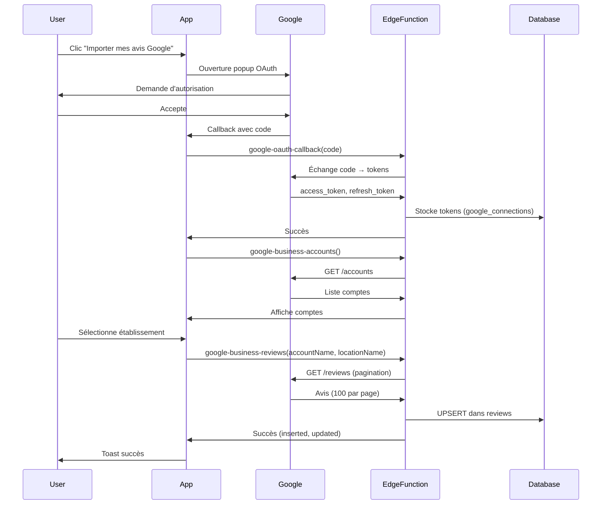

# Configuration OAuth Google Business Profile

## Prérequis

1. Avoir un projet Google Cloud Platform
2. Avoir un compte Google Business Profile

## Étapes de configuration

### 1. Créer les credentials OAuth dans Google Cloud Console

1. Accédez à [Google Cloud Console](https://console.cloud.google.com)
2. Sélectionnez ou créez un projet
3. Activez les APIs suivantes :
   - **Google My Business API**
   - **Google Business Profile API**

4. Allez dans **APIs & Services** > **Credentials**
5. Cliquez sur **Create Credentials** > **OAuth Client ID**
6. Configurez l'écran de consentement OAuth si ce n'est pas déjà fait :
   - Type d'application : **Web application**
   - User Type : **External** (pour tester) ou **Internal** (pour usage interne)
   - Scopes : `https://www.googleapis.com/auth/business.manage`

7. Créez un OAuth 2.0 Client ID :
   - Application type : **Web application**
   - Name : `Analytique Auto Import`
   - **Authorized JavaScript origins** :
     - `http://localhost:5173` (développement)
     - `https://VOTRE-DOMAINE-PRODUCTION.com`
   - **Authorized redirect URIs** :
     - `http://localhost:5173/google-callback` (développement)
     - `https://VOTRE-DOMAINE-PRODUCTION.com/google-callback`
     - `https://zzjmtipdsccxmmoaetlp.supabase.co/functions/v1/google-oauth-callback`

8. Cliquez sur **Create**
9. Copiez le **Client ID** et le **Client Secret**

### 2. Configurer les secrets dans Lovable

Les secrets `GOOGLE_CLIENT_ID` et `GOOGLE_CLIENT_SECRET` ont déjà été ajoutés via l'interface Lovable.

### 3. Ajouter le Client ID dans .env

Ouvrez le fichier `.env` et remplacez `YOUR_GOOGLE_CLIENT_ID_HERE` par votre véritable Client ID :

```env
VITE_GOOGLE_CLIENT_ID=VOTRE_CLIENT_ID_ICI.apps.googleusercontent.com
```

⚠️ **Important** : Le Client ID est un identifiant **public** qui peut être exposé côté client. En revanche, le Client Secret doit rester **confidentiel** et n'est utilisé que côté serveur (dans les edge functions).

### 4. Tester l'intégration

1. Allez sur `/etablissement`
2. Cliquez sur "Analysez vos avis" ou ouvrez la barre d'import
3. Sélectionnez l'onglet "Récupération auto"
4. Cliquez sur "Importer mes avis Google"
5. Autorisez l'accès à votre compte Google Business Profile
6. Vos avis seront automatiquement importés

## Architecture

### Edge Functions créées

1. **google-oauth-callback** : Gère le callback OAuth et stocke les tokens
2. **google-business-accounts** : Liste les comptes Google Business Profile
3. **google-business-locations** : Liste les établissements d'un compte
4. **google-business-reviews** : Importe tous les avis d'un établissement (avec pagination)

### Tables créées

1. **google_connections** : Stocke les tokens OAuth par utilisateur
2. **import_logs** : Trace les imports de avis (dates, nombres, statuts)
3. **reviews** (modifiée) : Colonnes ajoutées pour les avis Google

### Flux d'authentification



## Synchronisation planifiée (À venir - Phase 3)

La synchronisation automatique toutes les 6h sera implémentée avec :
- Un cron job Supabase
- Rafraîchissement automatique des tokens expirés
- Import incrémental (seulement les nouveaux avis)

## Dépannage

### Erreur "Autorisation refusée"
- Vérifiez que le scope `https://www.googleapis.com/auth/business.manage` est bien configuré
- Vérifiez que l'utilisateur a bien accepté les permissions

### Erreur "Aucun établissement trouvé"
- Vérifiez que l'utilisateur a bien un compte Google Business Profile actif
- Vérifiez que les APIs sont activées dans Google Cloud Console

### Token expiré
- Les tokens Google expirent après 1h
- Le refresh token permet de les renouveler automatiquement
- Si le refresh échoue, l'utilisateur doit se reconnecter

## Sécurité

- Les tokens sont stockés en base de données (Supabase)
- Row Level Security (RLS) activée sur toutes les tables
- Seul l'utilisateur propriétaire peut voir ses propres tokens
- Le Client Secret n'est jamais exposé côté client

## Conformité RGPD

- L'utilisateur peut déconnecter son compte Google à tout moment (bouton "Déconnecter" à venir dans Paramètres)
- Les avis déjà importés sont conservés même après déconnexion
- Les tokens sont supprimés lors de la déconnexion